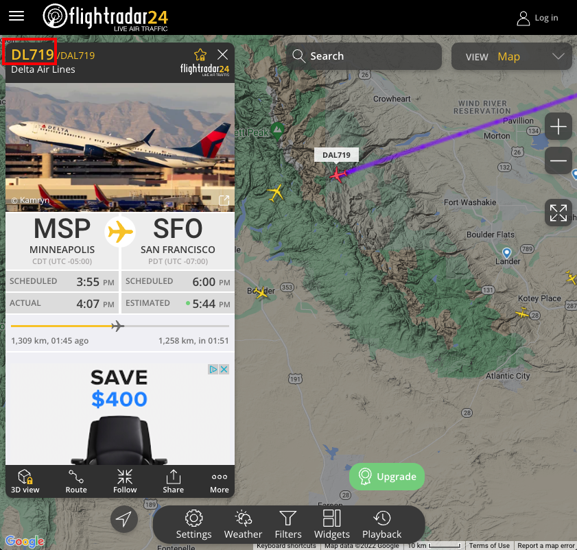

# RAPCON

**Radar Approach Control Facility (RAPCON)**

Is a facility based in an airport terminal that uses both non-radar and radar to provide services for planes that are moving through a controlled airspace, landing, or taking off. RAPCONs commonly operate near civil and military airports and may be controlled by the FAA, military or both.

## Project discription:

**Up for discussion**
The MVP of this project is:

1. access a flight tracking API that:
    - Creates an object out of flight data
    - Shows data about individual flights
    - Shows data about flights comming out/into a chosen airport.

2. Allows a user to subscribe to flight information:
    - When a flight departs
    - Tracks its status...
        - departure time;
        - ETA;
        - Ground speed
    - When a flight lands.

3. Show data about a given aircraft:
    - SQUAWK ID
    - Departing airport
    - Destination airport
    - Next destination

**Stretch Goals**

> Create a bot that tracks random aircraft and pushes its relevent data
> Create this app to support SMS texts to our users. (E.g. Send a text to Ryan about when his mother's flight arrives from ATL to SEA)

### Setup
- Clone repo to your machine.
  - using the `code` button in github 

- Make sure you have `node` installed and up to date
  - node --version
    - v16.13.2 and above
- Run an `npm i`  in the terminal 
  - this should download all dependencies needed to run the project

#### `.env` requirements
- `PORT` - Port Number(Make sure this anything but 3002)
- `API_KEY`- [API KEY](#airlabs)
- `DATABASE_URL`- Postgres
- `SECRET`- Auth 
- `Twilio_ACCOUNT_SID`- [Twilio Account](#TwilioAccountCreation)
- `Twilio_AUTH_TOKEN`- [Twilio Token](#TwilioAccountCreation)

#### Running the app
- Database
  
- `node index.js`
    - This is the first step that needs to happen in order to connect to the database and setup the flight and customer records tables.

- Socket 

  - `node src/server/index`
    -Start of Socket.io server 
      - This is the central hub for our socket.io server. Without this started you will not be able to correctly pass information from the other sockets. Make sure this is the first server you start for Sockets.
  - `node src/flightApi/index`
      - This will be receiving flightNumber and phoneNumber of the client then triggering an Api request to the AirLabs api. Make sure this is the Second server you start for Sockets.
  - `node src/client/index`
      - The user will be prompted to a flightNumber and PhoneNumber.
      - Since we are using the free version of Twilio We would need to verify 
      - Make sure this is the Last server you start for Sockets.
      - Please make sure your flightNumber is following the correct [IATA Code](https://azcargo.cz/en/services/support/iata-airline-codes/) structure. 
    - Airlines such as Delta, American Airlines, United are the most reliable when it comes to flight data
      - For tracking delta flights
        - In any Delta flightNUmber remove the A 
        - DAL704 ---> DL704
     - For tracking American Airline flights
        - Remove the L  
        - AAL704 ---> AA704
  - Finding flight number through [FlightRadar](https://www.flightradar24.com/).
    

### Rules for Socket Server
- After getting a payload message like the one below exit the flightApi Console.
 

## <a name="TwilioAccountCreation">Creating Twilio Account for Api Key</a>
  - [SignUp for Twilio by clicking this link](https://www.twilio.com/try-twilio)
  - Navigate to the Console homepage in the develop tab and grab your Account SID and Auth Token. 
     
  - Then just add that to your individual env file following the sample.env structure.
- [Further Help With Twilio](https://www.Twilio.com/docs/usage/tutorials/how-to-use-your-free-trial-account)
- Make sure the phone number that you are sending messages to is verified through Twilio. This is only needed for the free version of Twilio. Click [here](https://www.twilio.com/docs/usage/tutorials/how-to-use-your-free-trial-account#verify-your-personal-phone-number) for further help verifying phone number.

## <a name="airlabs">AirLabs-Api</a>
  - [SignUp for Airlabs Api by clicking this link](https://airlabs.co/signup)
  - Make sure to follow instructions given by Airlabs
  - Then After verifying and creating an account go to this [link](https://airlabs.co/account) and grab your api key. 
  - For further assistance visit [AirLabs-Docs](https://airlabs.co/docs/#docs_Introduction)
  
## TESTS

  - `npm test`: to run all test suites

## Team Members:

> Abdinasir Yussuf

> Elizabeth Hammes

> Beau Hibbert

> Marcus Hartwig

## Credit

**Socket.io testing code docs**
https://socket.io/docs/v4/testing/

**Air Labs API**
https://airlabs.co/docs/
